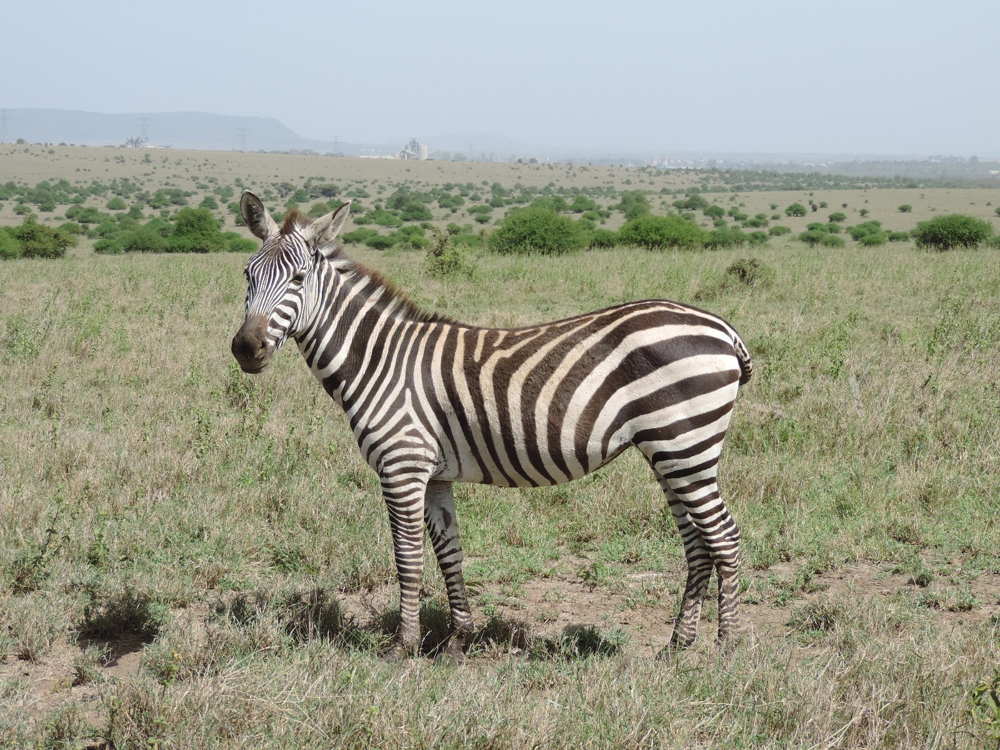
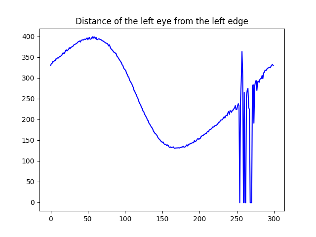
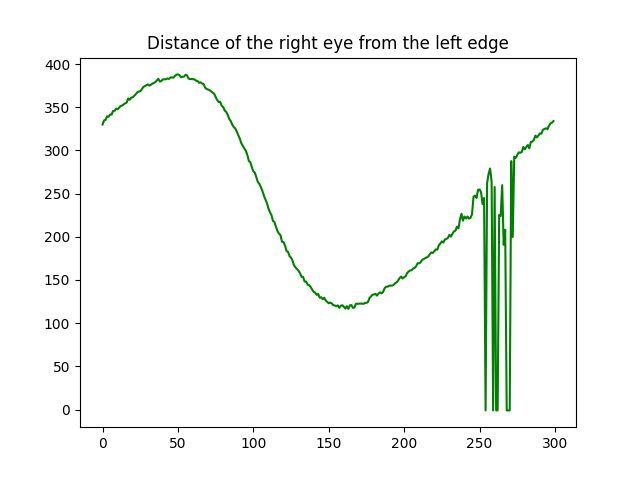
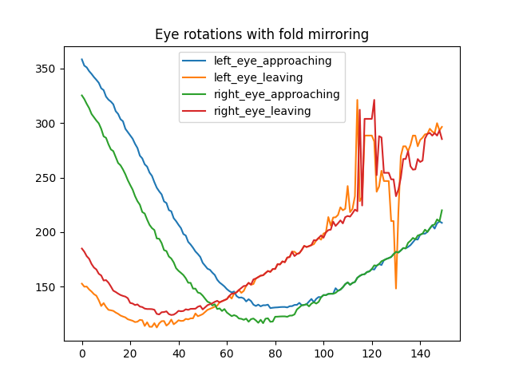
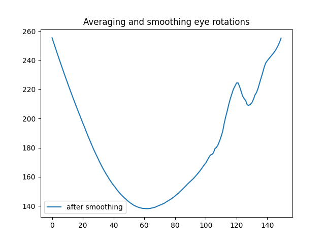
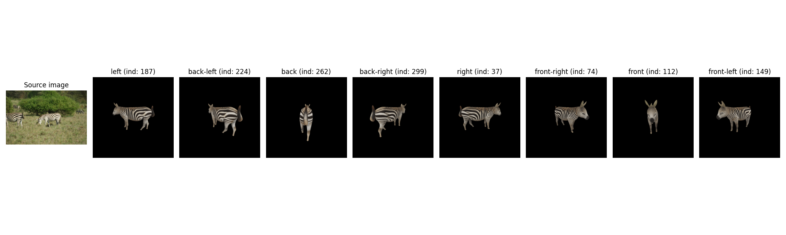

# Wildlife Re-Identification — Synthetic Data Pipeline
### GZGC Dataset | DSAIL-ReID Research Project

[](https://huggingface.co/datasets/DSAIL-ReID/synthetic-gzgc)
[](https://python.org)
[](https://github.com/aneneahs-kanaks)


---

## About This Repository

This repository documents my contribution to a masters-level wildlife re-identification research project at DSAIL. As a 4th-year Electrical and Electronics Engineering student on attachment, I contributed to building a complete synthetic data pipeline for training a Re-Identification (ReID) model for zebras and giraffes using the **Great Zebra and Giraffe Count (GZGC)** open public dataset.

This is both a research contribution and a personal learning journey into machine learning, computer vision, and data pipelines.

---

## What is Wildlife ReID?

Wildlife Re-Identification is the task of recognizing the same individual animal across multiple photographs taken at different times, locations, and viewing angles — without physical tags. This is critical for:
- Population monitoring and conservation
- Individual animal tracking over time
- Automating what previously required expert manual effort

---

## Dataset — Species Overview

The GZGC dataset contains photographs of two zebra species, each with distinct stripe patterns that serve as natural biometric identifiers.

| Grevy's Zebra | Plains Zebra |
|---|---|
|  |  |
| Narrow, closely spaced stripes | Broader, widely spaced stripes |
| White belly with no stripes | Stripes extend across belly |
| Larger body, rounded ears | Smaller body, pointed ears |
| Endangered species | Least concern |

---

## The Core Research Problem

Training a ReID model requires labeled images of the **same individual from multiple viewpoints**. In the wild, this is nearly impossible to collect at scale. Our solution:

> **Generate synthetic 3D models from real wildlife photos and render them from controlled 360° viewpoints — creating unlimited labeled training data.**

---

## Repository Structure

```
wildlife-reid-pipeline/
│
├── notebooks/
│   ├── 01_gzgc_single_object.ipynb      # 3D model generation from real photos
│   ├── 02_run_shards.ipynb              # Parallel keypoint detection across shards
│   └── 03_viewpoint_estimation.ipynb    # Eye tracking → viewpoint labels
│
├── notes/
│   ├── pipeline_overview.md             # Full pipeline explained
│   ├── notebook_01_notes.md             # Notes on 3D generation
│   ├── notebook_02_notes.md             # Notes on keypoint detection
│   └── notebook_03_notes.md             # Notes on viewpoint estimation
│
├── docs/
│   ├── images/                          # All visual assets
│   └── Wildlife_ReID_Full_Pipeline.pdf  # Complete pipeline documentation
│
└── README.md
```

---

## The Full Pipeline

```
STAGE 1 — 3D Model Generation
Real GZGC Photos → SAM3 Segmentation → Gaussian Splatting → 360° GIF Renders
                                                                      ↓
STAGE 2 — Keypoint Detection
360° GIF Renders → DeepLabCut (39 keypoints/frame) → JSON keypoint files
                                                                      ↓
STAGE 3 — Viewpoint Estimation
GIFs + JSON keypoints → Eye tracking → Sine wave analysis → Viewpoint labels
                                                                      ↓
STAGE 4 — Human Annotation  [CURRENT STAGE]
FiftyOne visualization → Human verification → Verified reference frames CSV
                                                                      ↓
STAGE 5 — ReID Model Training  [UPCOMING]
Verified viewpoints → Training pairs → Metric learning → ReID model
```

---

## Notebooks

### `01_gzgc_single_object.ipynb` — 3D Generation
Takes real GZGC wildlife photos and converts them into 3D models using Gaussian Splatting, then renders 360° animated GIFs.

**Key steps:**
- Load SAM3 pre-computed segmentation masks
- Filter masks by size (threshold = 10% of image dimensions)
- Run Gaussian Splatting inference per animal instance
- Render 300-frame 360° GIF at 30fps
- Export GLB mesh and PLY gaussian splat
- Upload all outputs to HuggingFace

---

### `02_run_shards.ipynb` — Parallel Keypoint Detection
Uses Papermill and ThreadPoolExecutor to run DeepLabCut keypoint detection on all 8 dataset shards simultaneously.

**Key steps:**
- Configure 8 shard IDs and 8 parallel workers
- Use Papermill to programmatically execute the keypoints notebook per shard
- DeepLabCut detects 39 anatomical keypoints per frame
- Outputs one JSON file per GIF containing all keypoint positions

---

### `03_viewpoint_estimation.ipynb` — Viewpoint Estimation
The core algorithmic notebook. Uses eye keypoint tracking to find the canonical viewpoint frames in each 360° GIF.

**Key steps:**
- Reformat keypoints from frame-organized to keypoint-organized structure
- Extract left and right eye x-positions across all 300 frames
- Forward/backward fill missing detections
- Smooth signal using Savitzky-Golay filter
- Find trough (minimum) = animal facing left
- Extract 8 canonical viewpoints spaced 37.5 frames apart
- Load results into FiftyOne for human verification

---

## Motion Signal Analysis

The viewpoint estimation algorithm works by tracking eye positions across all 300 frames of each GIF and finding the sinusoidal pattern that reveals the animal's orientation.

### Step 1 — Raw Eye Tracking

The x-position of each eye is extracted across all 300 frames. The resulting signal approximates a sine wave — because circular rotation projected onto the x-axis produces a sinusoidal path.

| Left Eye Signal | Right Eye Signal |
|---|---|
|  |  |

The noisy section towards the end (frames 250+) is where the eye becomes occluded — handled in the next step.

---

### Step 2 — Signal Alignment

After forward/backward filling missing detections, the signal is shifted to align the trough to a standard position, making processing consistent across all animals.


---

### Step 3 — Fold Mirroring

The signal is folded at the halfway point to create approaching and leaving components for both eyes — giving 4 signals for more robust averaging.



---

### Step 4 — Smoothed Result

All 4 signals are averaged and smoothed using a Savitzky-Golay filter. The trough (minimum point) of this final signal corresponds to the frame where the animal faces directly left.



---

## Viewpoint Estimation Results

Starting from the identified left-facing frame (trough), 8 canonical viewpoints are extracted at equal intervals of 37.5 frames, covering the full 360° rotation.



The pipeline successfully extracts all 8 canonical directions — left, back-left, back, back-right, right, front-right, front, front-left — from a single source wildlife image.

---

## Key Technical Insight

**Why use only the eyes for viewpoint estimation?**

When an animal rotates 360°, the x-position of each eye traces a sinusoidal path — because circular motion projected onto one axis produces a sine wave. The eyes satisfy all three requirements for a reliable orientation signal:

1. **Periodic signal** — repeats every 360°
2. **Clean and stable** — eyes are fixed on the head, not moving independently
3. **Symmetric pair** — left and right eye for noise reduction by averaging

This approach converts a computer vision problem into a signal processing problem — finding the trough of a sine wave to determine the leftward-facing orientation. This is characteristic of Electrical Engineering thinking applied to computer vision.

---

## Tools and Technologies

| Tool | Purpose |
|---|---|
| SAM3 | Text-prompted animal segmentation |
| Gaussian Splatting | 2D photo to 3D model reconstruction |
| DeepLabCut | 39-keypoint animal pose estimation |
| FiftyOne | Dataset visualization and annotation |
| HuggingFace Hub | Dataset hosting and versioning |
| Papermill | Programmatic notebook execution |
| SciPy | Signal smoothing (Savitzky-Golay filter) |
| PyTorch | GPU-accelerated deep learning inference |
| Python / Jupyter | Core development environment |

---

## Dataset

- **Name:** Great Zebra and Giraffe Count (GZGC)
- **Type:** Open public dataset
- **Size:** 4,948 real wildlife photographs
- **HuggingFace:** [DSAIL-ReID/synthetic-gzgc](https://huggingface.co/datasets/DSAIL-ReID/synthetic-gzgc)
- **Shards processed:** 8 shards (IDs 2 to 9)

---

## Related Work

This project is closely related to [MAVRIC](https://github.com/Imageomics/MAVRIC) — a video-based animal re-identification pipeline presented at CVPR 2025 by Imageomics. While MAVRIC processes real video footage of Grévy's zebras, our pipeline generates synthetic 3D renders from the GZGC photo dataset, providing a complementary approach to the wildlife ReID problem.

---

## About Me

I am a 4th-year Electrical and Electronics Engineering student with a deep interest in Machine Learning and Computer Vision. I joined this research project as an attachment assistant and have been contributing to the full pipeline while independently learning the underlying concepts.

This repository is part of my effort to document everything I learn — not just for grades, but because I genuinely want to understand the field deeply and pursue research in ML and CV.

---

## Documentation

Full pipeline documentation is available as a PDF in the `docs/` folder covering:
- Complete pipeline from real photos to verified viewpoint labels
- All three notebooks explained in detail
- Key concepts and glossary
- Tools and technologies reference
- Next steps and road ahead

---

*Research project by DSAIL-ReID | Contributor: [@aneneahs-kanaks](https://github.com/aneneahs-kanaks)*
